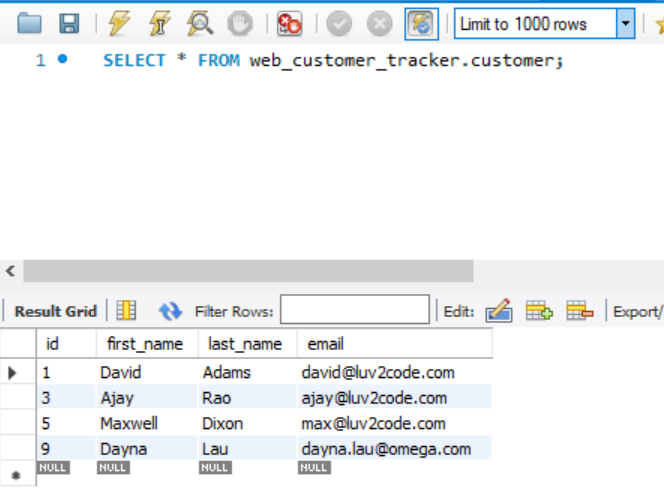

# Web Customer Tracker
## Customer Relationship Management Demo

Complete CRM service that includes adding new customers, updating their information and deleting them from the database.

## Setup
Created using Eclipse, Spring MVC and MySQL.

Used Apache Tomcat v9.0 server.

## Demo

Adding a new customer.

This is reflected in the database in MySQL.

Updating a customer.

Deleting a customer.

